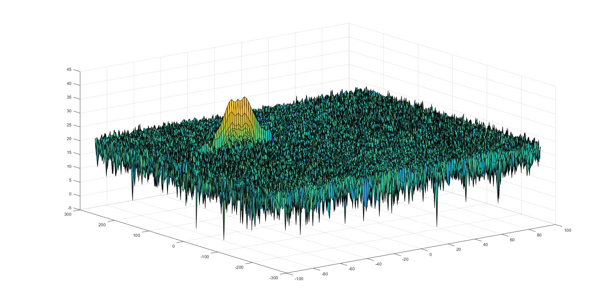
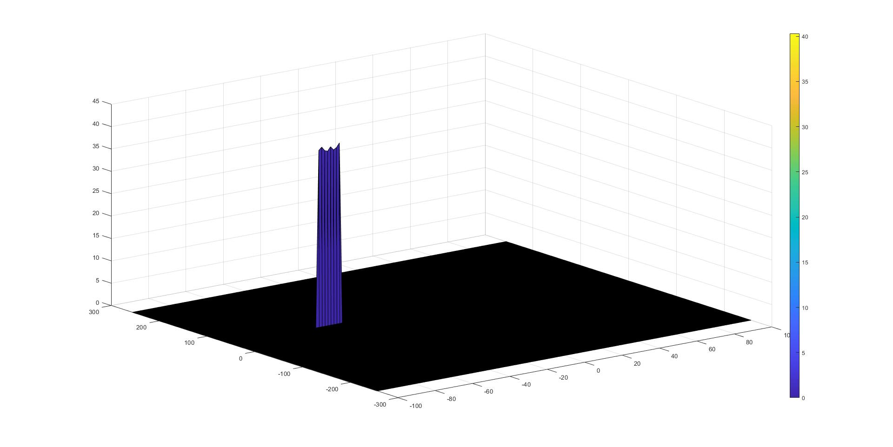

# SFND_Radar_Target_Generation_and_Detection
#### 1. Radar Specifications 
* Frequency of operation = 77GHz
* Max Range = 200m
* Range Resolution = 1 m
* Max Velocity = 100 m/s
```
Max_Range_of_Radar = 200; 
Max_Velocity_of_Radar = 100;
Range_Resolution_of_Radar = 1;
speed_of_light = 3e8;
```

#### 2. User Defined Range and Velocity of target

* define the target's initial position and velocity. 
* Note : Velocity remains contant
```
Range_of_target = 50; % Target Initial Range
Velocity_of_target  = -50; % Target Velocity
```

#### 3. FMCW Waveform Generation 
* Design the FMCW waveform by giving the specs of each of its parameters.
* Calculate the Bandwidth (B), Chirp Time (Tchirp) and Slope (slope) of the FMCW
* chirp using the requirements above.
```
d_res = 1;
c = 3e8;
r_max = 200;
```
* distance resolution = c/(2 * Bsweep)
```
Bsweep = c/(2*d_res);       %Bandwidth
Tchirp = 5.5*2*r_max/c;     %chirp time
slope = Bsweep/Tchirp;      %slope of chirp
```
* Operating carrier frequency of Radar 
```
fc= 77e9;             %carrier freq
```

* The number of chirps in one sequence. Its ideal to have 2^ value for the ease of running the FFT for Doppler Estimation
```. 
Nd=128;                   % #of doppler cells OR #of sent periods % number of chirps
```
* The number of samples on each chirp. 
```
Nr=1024;                  %for length of time OR # of range cells
```
*  Timestamp for running the displacement scenario for every sample on each chirp
```
t=linspace(0,Nd*Tchirp,Nr*Nd); %total time for samples
```

* Creating the vectors for Tx, Rx and Mix based on the total samples input.
```
Tx=zeros(1,length(t)); %transmitted signal
Rx=zeros(1,length(t)); %received signal
Mix = zeros(1,length(t)); %beat signal
```
* Similar vectors for range_covered and time delay.
```
r_t=zeros(1,length(t));
td=zeros(1,length(t));
```

#### 4. Signal generation and Moving Target simulation
```
for i=1:length(t)         
    
    
    % *%TODO* :
    %For each time stamp update the Range of the Target for constant velocity. 
    r_t(i) = d0 + v0*t(i);
    td(i) = 2*r_t(i)/c;
    % *%TODO* :
    %For each time sample we need update the transmitted and
    %received signal. 
    Tx (i) = cos(2*pi*(fc*t(i) + slope*t(i)^2/2));
    Rx (i) = cos(2*pi*(fc*(t(i)-td(i)) + slope*(t(i)-td(i))^2/2));
    
    % *%TODO* :
    %Now by mixing the Transmit and Receive generate the beat signal
    %This is done by element wise matrix multiplication of Transmit and
    %Receiver Signal
    Mix(i) = Tx(i).*Rx(i);
    
end
```

#### 5. Range Measurement

* Reshape the vector into Nr*Nd array. 
* Nr and Nd here would also define the size of Range and Doppler FFT respectively.
```
Mix = reshape(Mix,[Nr,Nd]);
```
* run the FFT on the beat signal along the range bins dimension (Nr) and
```
sig_fft1 = fft(Mix,Nr);  
```
* normalize.
```
sig_fft1 = sig_fft1./Nr;
```
* Take the absolute value of FFT output
```
sig_fft1 = abs(sig_fft1);  
```
* Output of FFT is double sided signal, but we are interested in only one side of the spectrum.
* Hence we throw out half of the samples.
```
single_side_sig_fft1 = sig_fft1(1:Nr/2);
```
* Plotting the range, plot FFT output 
```
figure ('Name','Range from First FFT')
plot(single_side_sig_fft1); 
axis ([0 200 0 1]);
```

#### 6. Range Doppler Response
* The 2D FFT implementation is already provided here. 
* This will run a 2DFFT on the mixed signal (beat signal) output and generate a range doppler map.
* You will implement CFAR on the generated RDM Range Doppler Map Generation.
* The output of the 2D FFT is an image that has reponse in the range and doppler FFT bins. 
* So, it is important to convert the axis from bin sizes to range and doppler based on their Max values.
```
Mix = reshape(Mix,[Nr,Nd]);
```
* 2D FFT using the FFT size for both dimensions.
```
sig_fft2 = fft2(Mix,Nr,Nd);
```
* Taking just one side of signal from Range dimension.
```
sig_fft2 = sig_fft2(1:Nr/2,1:Nd);
sig_fft2 = fftshift (sig_fft2);
RDM = abs(sig_fft2);
RDM = 10*log10(RDM) ;
```
* Use the surf function to plot the output of 2DFFT and to show axis in both dimensions
```
doppler_axis = linspace(-100,100,Nd);
range_axis = linspace(-200,200,Nr/2)*((Nr/2)/400);
figure ('Name','Range and Speed From FFT2')
surf(doppler_axis,range_axis,RDM);
```
* Simulation Result


#### 7. CFAR implementation
* Slide Window through the complete Range Doppler Map
* Select the number of Training Cells in both the dimensions.
```
Tr = 12;
Td = 8;
```
* Select the number of Guard Cells in both dimensions around the Cell under test (CUT) for accurate estimation
```
Gr = 4;
Gd = 4;
```
* Offset the threshold by SNR value in dB
```
offset = 1.6;
```
* Create a vector to store noise_level for each iteration on training cells 
```
noise_level = zeros(size(RDM));
gridSize = (2*Tr+2*Gr+1)*(2*Td+2*Gd+1);
trainingcellNum = gridSize-(2*Gr+1)*(2*Gd+1);

```
* design a loop such that it slides the CUT across range doppler map by giving margins at the edges for Training and Guard Cells.
* For every iteration sum the signal level within all the training cells. 
* To sum convert the value from logarithmic to linear using db2pow function. 
* Average the summed values for all of the training cells used.
* After averaging convert it back to logarithimic using pow2db.
* Further add the offset to it to determine the threshold. 
* Next, compare the signal under CUT with this threshold. 
* If the CUT level > threshold assign % it a value of `1`, else equate it to `0`.
* Use `RDM[x,y]` as the matrix from the output of 2D FFT for implementing CFAR
```   
for i = Tr+Gr+1:Nr/2-Tr-Gr
    for j = Td+Gd+1:Nd-Td-Gd
        outer = RDM(i-Tr-Gr:i+Tr+Gr,j-Td-Gd:j+Td+Gd);
        inner = RDM(i-Gr:i+Gr,j-Gd:j+Gd);
        noise_level(i,j) = offset * pow2db((sum(sum(db2pow(outer)))-sum(sum(db2pow(inner))))/trainingcellNum);      
    end
end
```
* The process above will generate a thresholded block, which is smaller than the Range Doppler Map as the CUT cannot be located at the edges of matrix. 
* Hence,few cells will not be thresholded. 
* To keep the map size same set those values to 0. 
```
CFAR_sig_mask = zeros(size(RDM));
CFAR_sig_edge = zeros(size(RDM));
CFAR_sig_edge(Tr+Gr+1:Nr/2-Tr-Gr,Td+Gd+1:Nd-Td-Gd) = 1;
CFAR_sig_mask(RDM>noise_level) = 1;
CFAR_sig = RDM.*CFAR_sig_mask.*CFAR_sig_edge;
 
```
* Display the CFAR output using the Surf function like we did for Range
* Doppler Response output.
```
figure,surf(doppler_axis,range_axis,CFAR_sig);
colorbar;
```
* Simulation Result


